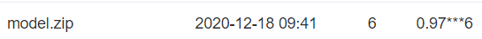
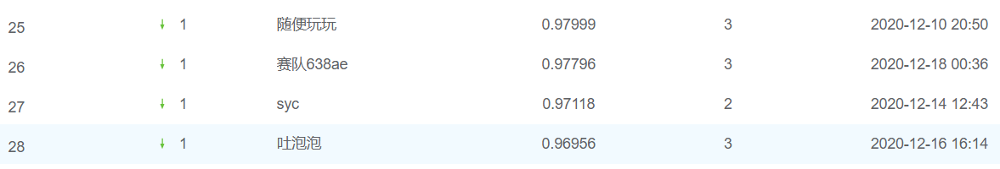

>_author_   :   oukohou  
>_time_     :  2020-12-17 19:01:42 
>_email_    :   oukohou@outlook.com

### 0. 不需要关注公众号，也不需要转发朋友圈，只求您大手一挥，`star`、`fork`、`follow` 三连！！！！

### 1. train：  
- pip install -r requirments.txt  
- 修改 `train_model.py` 里的训练参数  
- python train_model.py  

### 2. predict：
- 将训练好的模型copy到 `./model`  
- 修改 `./model/run.py` 里的参数，本地测试一下是否出错    
- 压缩为 `model.zip`并提交；

### 3. score：  
当前得分为 `0.97xxx6`:  
  
截止到 2020-12-18 09:58:20排名至少为 *top28*：  

### 4. 最重要的：  
不需要关注公众号，也不需要转发朋友圈，只求您大手一挥，`star`、`fork`、`follow` 三连！！！！
敬请持续关注，如果最终能得名次，会在我的知乎专栏[深度学习深度学习](https://www.zhihu.com/column/oukohou-DL)、我的个人博客[璇珠杂俎](https://www.oukohou.wang)上分享比赛心得及技巧～～
